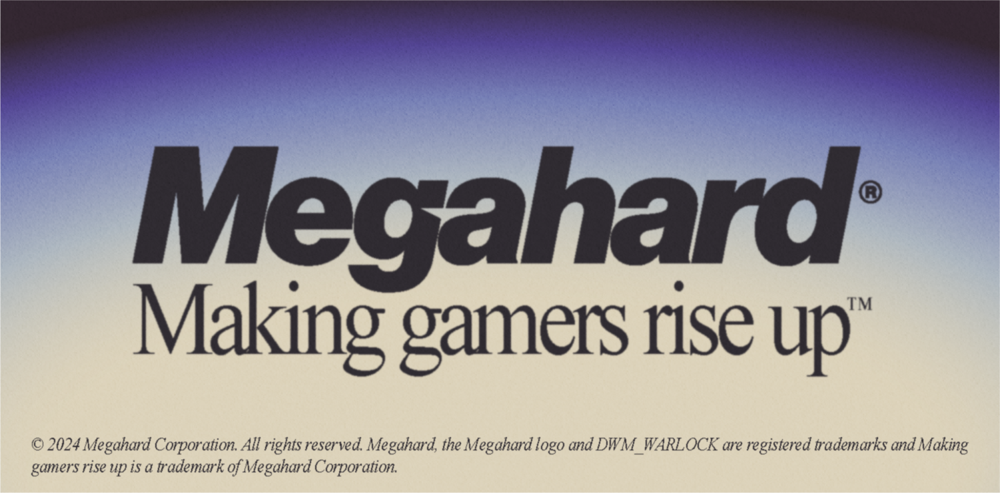

# Fox Hunt
_Codename: **DWM_WARLOCK**_  
Entry for the XP Study Association's 2024 GameJam

Description goes here

## Credits
_Developed by **Megahard**_ using the [Processing](https://processing.org/) Framework.  

Team members:

| Designer                                     | Programmer                                      | Programmer                                          |
|----------------------------------------------|-------------------------------------------------|-----------------------------------------------------|
| **[koksiroj](https://github.com/koksiroj)**  | **[Nine-Theta](https://github.com/Nine-Theta)** | **[TechnicJelle](https://github.com/TechnicJelle)** |

All sound effects in this game are generated using [rFXGen](https://github.com/raysan5/rfxgen).

## Building
To build the game, you need to have Processing 4 installed. You can download it [here](https://processing.org/download/).

After installing Processing, you have to install the **Sound** library.
You can do this by going to `Sketch > Import Library... > Manage Libraries...` and searching for `Sound`.
Then finally, install the library by clicking the `Install` button.

You can then open the `DWM_WARLOCK.pde` file in Processing and run the game by clicking the play button.
